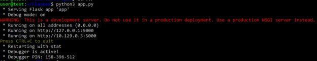
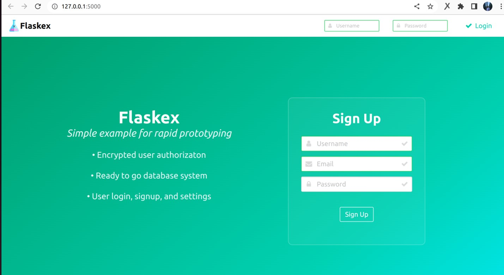

Для установки приложения по инструкции из репозитория https://github.com/anfederico/flaskex нам потребуется установить python3 и pip3:
У меня ubuntu, поэтому команды будут выглядеть таким образом:
```bash
sudo apt install python3-minimal
python3 –V
sudo apt install python3-pip
pip3 install --user --upgrade pip
```
Далее следуем клонируем репозиторий:
```bash
git clone https://github.com/anfederico/Flaskex
```
устанавливаем зависимости:
```bash
cd Flaskex
pip install -r requirements.txt
```
запускаем с помощью:
```bash
python app.py
```
Видим, что корректнее запустить с помощью python3:

```bash
user@test:~/Flaskex$ python app.py
Command 'python' not found, did you mean:
  command 'python3' from deb python3
  command 'python' from deb python-is-python3
user@test:~/Flaskex$ python3 app.py
Traceback (most recent call last):
  File "/home/user/Flaskex/app.py", line 4, in <module>
    from scripts import forms
  File "/home/user/Flaskex/scripts/forms.py", line 6, in <module>
    class LoginForm(Form):
  File "/home/user/Flaskex/scripts/forms.py", line 7, in LoginForm
    username = StringField('Username:', validators=[validators.required(), validators.Length(min=1, max=30)])
AttributeError: module 'wtforms.validators' has no attribute 'required'
```

Гуглим ошибку и выясняем, что в версии v1.0.2 библиотеки WTForms изменился синтаксис и нам нужно исправить модуль нашего приложения. 

Меняем в файле /scripts/forms.py: ```validators.required() на validators.DataRequired()```

```python
class LoginForm(Form):
    username = StringField('Username:', validators=[validators.required(), validators.Length(min=1, max=30)])
    password = StringField('Password:', validators=[validators.required(), validators.Length(min=1, max=30)])
    email = StringField('Email:', validators=[validators.optional(), validators.Length(min=0, max=50)])
```

```python
class LoginForm(Form):
    username = StringField('Username:', validators=[validators.DataRequired(), validators.Length(min=1, max=30)])
    password = StringField('Password:', validators=[validators.DataRequired(), validators.Length(min=1, max=30)])
    email = StringField('Email:', validators=[validators.optional(), validators.Length(min=0, max=50)])
```

Теперь запускаем наше приложение:



Переходим по ссылке и видим окно логина:



Теперь упакуем наше приложение в контейнер, чтобы легче его запускать будущем:

```bash
docker build -t flask:0.0.1 .
```

И проверим, что контейнер корректно запускается:

```bash
docker run -p 5000:5000 flask:0.0.1
```

И загружаем его на hub.docker:
```bash
docker push alexeiemelin/flask:0.0.1
```

https://hub.docker.com/r/alexeiemelin/flask:0.0.1

Завернем наш контейнер в docker-compose.yml и запустим:

```bash
docker-compose up
```